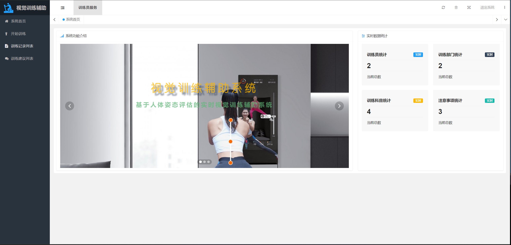
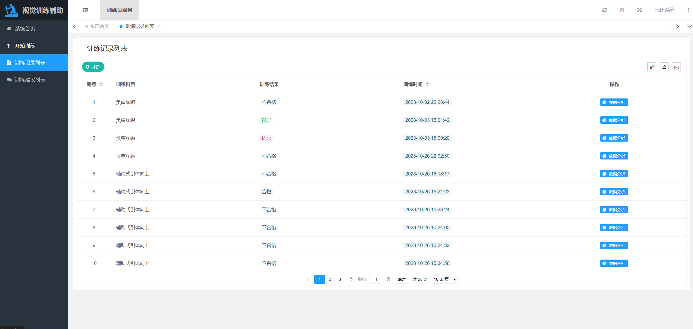
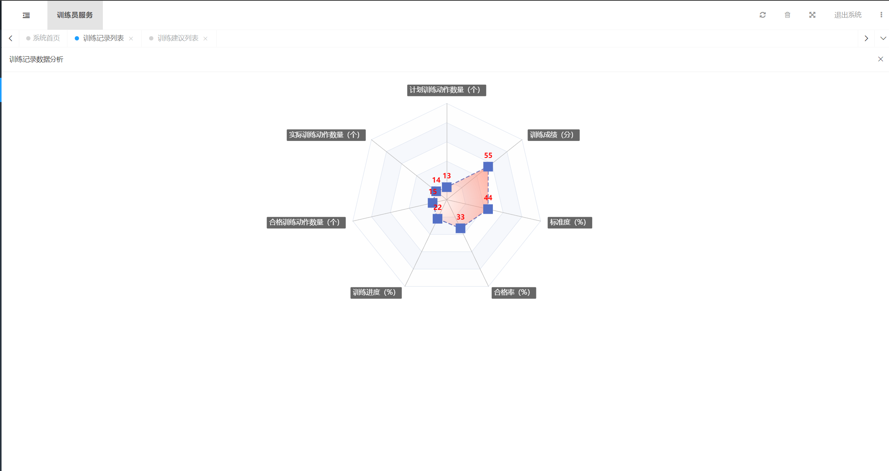
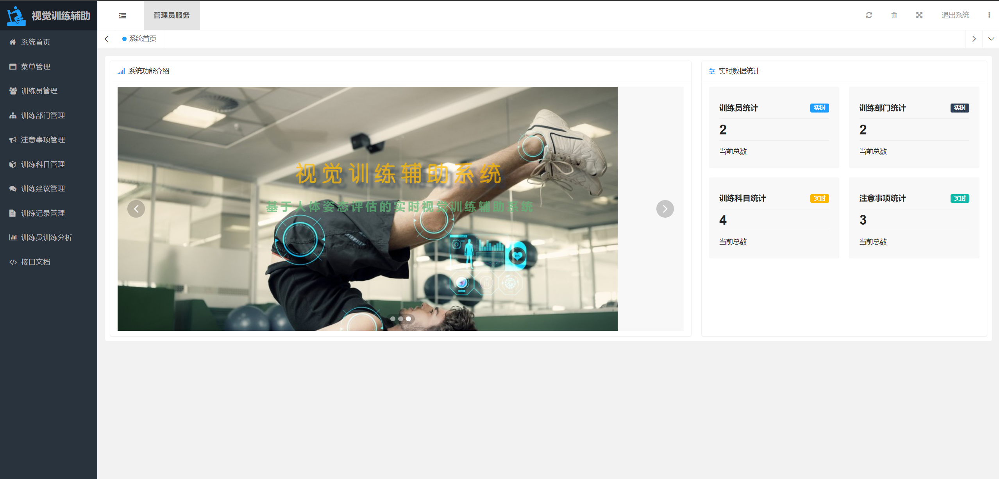
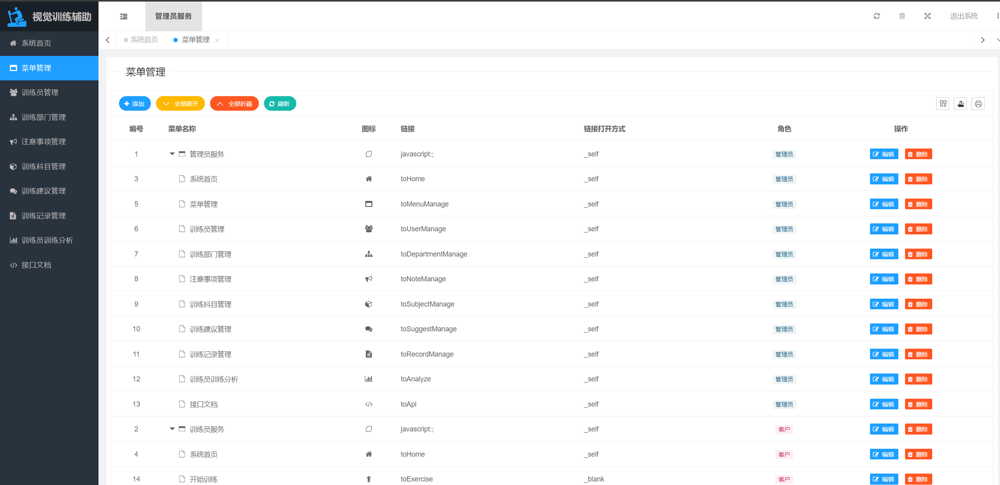

# 03—运动训练辅助系统

##### 技术支持：获取完整的代码+v ：Ai1763591756 提供完整的技术支持

使用摄像头捕获人体关键点进行人体姿态动作识别分析的系统

### 设计到的技术点：

##### 1，基于关节点进行的动作识别

##### 2，基于springboot的系统开发

##### 3，基于嵌入式的握力器等数据的联动传输

##### 页面展示

登录界面：

功能界面：

